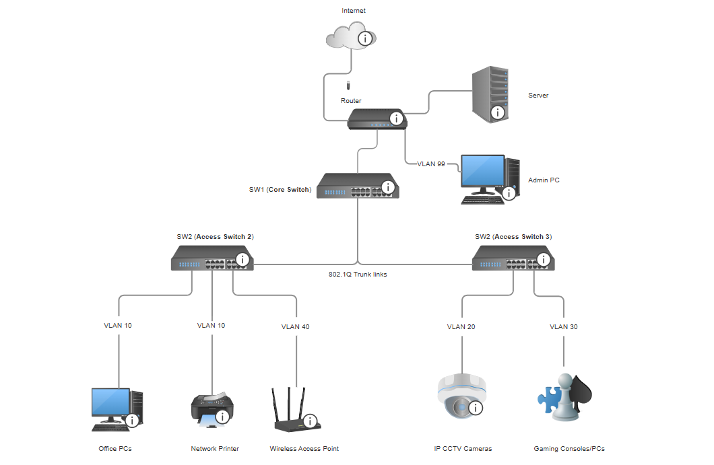
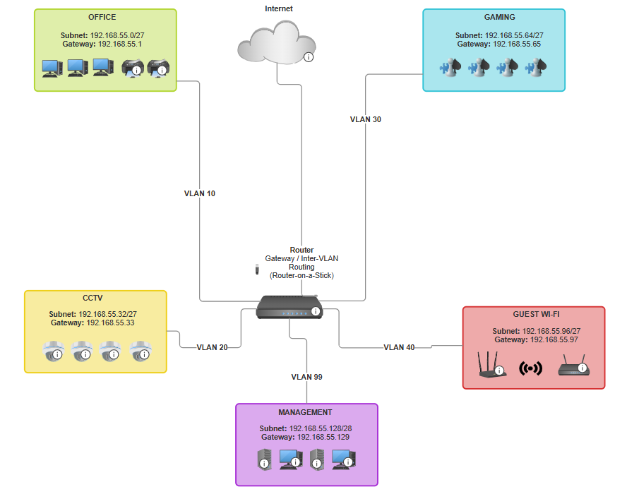

# CMPG 325 - Computer Networks
## Project ID: CMPG325-2026-125
## Leano Gaming Lounge Network Design

**Author:** Mateye Sydney Selota  
**Student Number:** 37633805   

---

## Table of Contents

A. Client Requirements  
B. IP Addressing  
C. 1. Physical Topology Design  
C. 2. Logical Topology Design  
D. Software Tools And Project Portfolio 

---

## A. Client Requirements

## 1. Background

The assigned client for this project is Leano Gaming Lounge, an entertainment establishment located in Mahikeng. The organisation operates as a venue where customers frequent to utilise gaming consoles and entertainment services. The business also conducts administrative operations, maintains security surveillance systems, and has identified the need to provide guest Wi-Fi services to enhance the customer experience.

---

## 2. Network Situation

The organization requires a centralized network architecture that facilitates seamless data exchange between various departments while maintaining high availability. The following departments must be accommodated within the **192.168.55.0/24** addressing block:

- **Gaming Operations:** Requires high-bandwidth connectivity for gaming consoles and PCs.
- **Administration:** Dedicated infrastructure for office personnel, including workstations and shared peripherals (printers/servers).
- **Security Infrastructure:** Integration of a CCTV surveillance system.
- **Public Access:** Wireless connectivity for visitors (implemented via Change Request CR3).

To ensure network integrity and performance, the design addresses the following critical constraints:

- **Data Vulnerability:** Sensitive office data and financial records are at risk if they are accessible from the public gaming area or the security system.
- **Public Security Risks:** Providing Guest Wi-Fi creates a potential "backdoor" into the private business network if not properly managed.
- **Traffic Congestion:** Without proper organization, heavy gaming traffic and high-resolution CCTV footage could slow down essential office functions.
- **Physical Limitations:** Because the layout requires multiple switches, the network must be able to carry different types of traffic across the same physical cables without mixing them up.

---

## 3. Project Objectives

- **Traffic Segmentation:** Implement a VLAN-based architecture to separate the Gaming, Office, and CCTV departments into private logical zones.
- **Strict Security Isolation:** Ensure that CCTV traffic is completely segmented from the Office network. Additionally, the Guest Wi-Fi must be restricted from accessing any internal business resources.
- **Implementation of 802.1Q Trunking:** Establish stable trunk links between switches to allow all VLANs to communicate across the entire facility correctly.
- **Efficient IP Management:** Divide the assigned 192.168.55.0/24 block into logical subnets that provide enough IP addresses for each department while preventing address waste.

---

## B. IP ADDRESSING

### 1. Efficient Subnetting using VLSM

The IP addressing plan for Leano Gaming Lounge is built using the assigned **192.168.55.0/24** block, utilizing Variable Length Subnet Masking (VLSM) to ensure maximum efficiency. By dividing the network into specific /27 and /28 subnets, the design provides enough host addresses for high-traffic areas like Gaming and Guest Wi-Fi while preventing address waste in smaller segments like CCTV and Management.

This structured approach creates organized broadcast domains for each department, which reduces network congestion and ensures the system is scalable for future business growth.

### 2. Logical Segmentation and Security Gateway

To satisfy the client's security constraints, a VLAN-based architecture is used to logically isolate different types of traffic. Inter-VLAN routing is managed through a **Router-on-a-Stick (RoaS)** configuration, where a single physical router port is divided into multiple logical sub-interfaces. Each sub-interface serves as a dedicated Default Gateway for a specific VLAN (e.g., Office, CCTV, or Guest).

This design is crucial for security as it allows the network to keep sensitive CCTV and Office data separate, while also ensuring the Guest Wi-Fi is strictly isolated from internal business resources, as requested in the project brief.

### 3. IP Addressing Table

| Device Name | Interface | VLAN | IP Address | Subnet Mask | Default Gateway |
| :--- | :--- | :--- | :--- | :--- | :--- |
| **R1 (Router)** | G0/0.99 | 10 | 192.168.55.1 | 255.255.255.224 | N/A |
| **R1 (Router)** | G0/0.99 | 20 | 192.168.55.33 | 255.255.255.224 | N/A |
| **R1 (Router)** | G0/0.99 | 30 | 192.168.55.65 | 255.255.255.224 | N/A |
| **R1 (Router)** | G0/0.99 | 40 | 192.168.55.97 | 255.255.255.224 | N/A |
| **R1 (Router)** | G0/0.99 | 99 | 192.168.55.129 | 255.255.255.240 | N/A |
| **SW1 (Core)** | VLAN 99 | 99 | 192.168.55.130 | 255.255.255.240 | 192.168.55.129 |
| **SW1 (Access 1)** | VLAN 99 | 99 | 192.168.55.131 | 255.255.255.240 | 192.168.55.129 |
| **SW1 (Access 2)** | VLAN 99 | 99 | 192.168.55.132 | 255.255.255.240 | 192.168.55.129 |
| **Server** | NIC | 99 | 192.168.55.140 | 255.255.255.240 | 192.168.55.129 |
| **Office PC 1** | NIC | 10 | 192.168.55.2 | 255.255.255.224 | 192.168.55.1 |
| **CCTV Cam 1** | NIC | 20 | 192.168.55.34 | 255.255.255.224 | 192.168.55.33 |
| **Gaming PC 1** | NIC | 30 | 192.168.55.66 | 255.255.255.224 | 192.168.55.65 |
| **Guest Laptop** | Wireless | 40 | 192.168.55.98 | 255.255.255.224 | 192.168.55.97 |

### 4. VLAN & VLSM

| VLAN ID | Name | Subnet Address | Mask (CIDR) | Broadcast Address | Purpose |
| :--- | :--- | :--- | :--- | :--- | :--- |
| 10 | Office | 192.168.55.0 | /27 | 192.168.55.31 | Staff & Printers |
| 20 | CCTV | 192.168.55.32 | /27 | 192.168.55.63 | Segmented Security |
| 30 | Gaming | 192.168.55.64 | /27 | 192.168.55.95 | Performance Gaming |
| 40 | Guest Wi-Fi | 192.168.55.96 | /27 | 192.168.55.127 | Isolated Visitors |
| 99 | Management | 192.168.55.128 | /28 | 192.168.55.143 | Switches & Servers |

---

## C. PHYSICAL TOPOLOGY AND LOGICAL TOPOLOGY

## C. 1. Physical Topology Design

The physical design for Leano Gaming Lounge follows a hierarchical star-bus topology, chosen for its reliability and scalability. A central router (R1) serves as the primary gateway, connected to a Core Switch (SW1) that manages the backbone of the network.

To meet the organization's layout requirements, two Access Switches (SW2 and SW3) are deployed. The most critical physical component is the implementation of **802.1Q Trunk links** between the switches.

These high-speed backbone connections are designed to carry multiple VLAN tags simultaneously, allowing the network to function across multiple physical rooms or floors while maintaining strict logical separation. This approach reduces the need for excessive cabling and hardware, providing a cost-effective and professional infrastructure.

---

## C. 2. Logical Topology Design

The logical design is centered around security and traffic optimization. Using the assigned 192.168.55.0/24 block, Variable Length Subnet Masking (VLSM) was applied to divide the network into five distinct Virtual LANs (VLANs).

- **Security Segmentation:** In direct response to the client's design constraints, the CCTV (VLAN 20) and Office (VLAN 10) networks are logically isolated. This ensures that sensitive administrative data and private security footage remain private and protected from unauthorized access.
- **Guest Isolation (CR3):** The Guest Wi-Fi (VLAN 40) is configured as a standalone logical zone. This ensures that visitors can access the internet without having any visibility or access to the internal Gaming or Office servers.
- **Routing Efficiency:** Inter-VLAN routing is handled via Router-on-a-Stick (RoaS). By using sub-interfaces on the R1 Router, we create a secure, controlled "traffic cop" that only allows authorized data to move between specific VLANs.

---

## D. SOFTWARE TOOLS AND PROJECT PORTFOLIO

- **Cisco Packet Tracer:** The primary simulation environment used to build the physical topology, configure the 802.1Q trunking protocols, and perform end-to-end connectivity testing.
- **SmartDraw:** A professional-grade design tool used to generate the Physical and Logical Topology diagrams. This ensured that all technical representations meet industry standards for clarity and precision.
